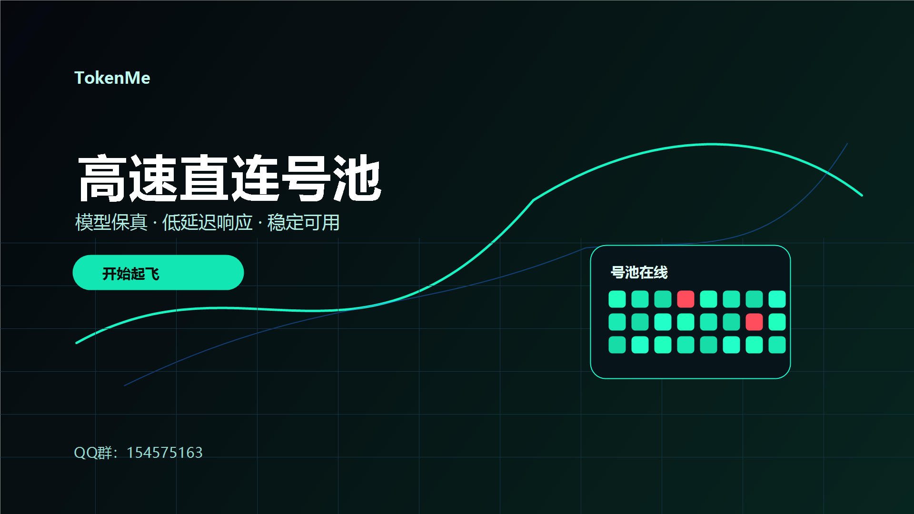
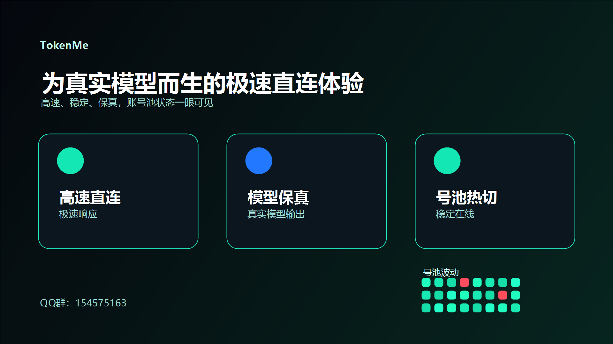
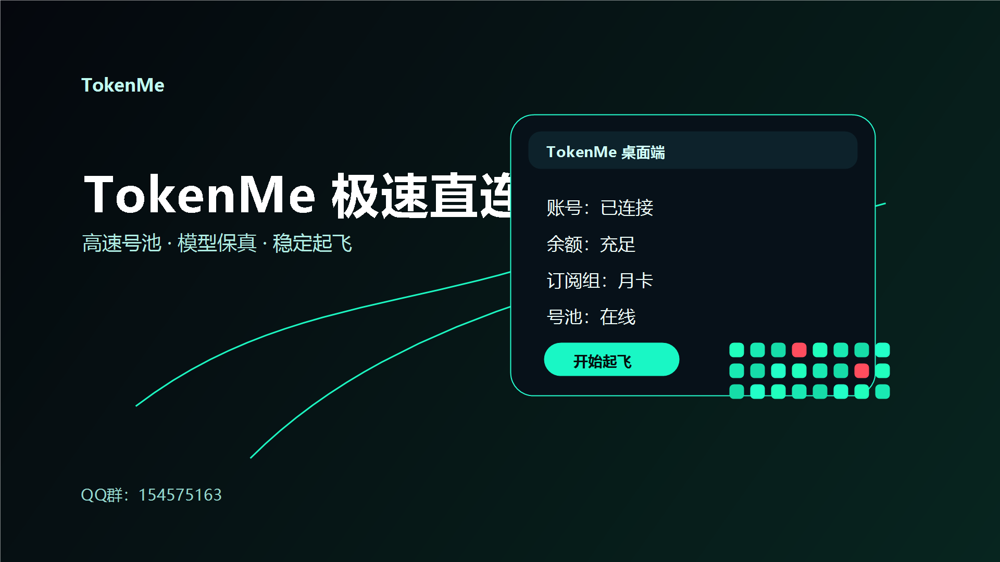
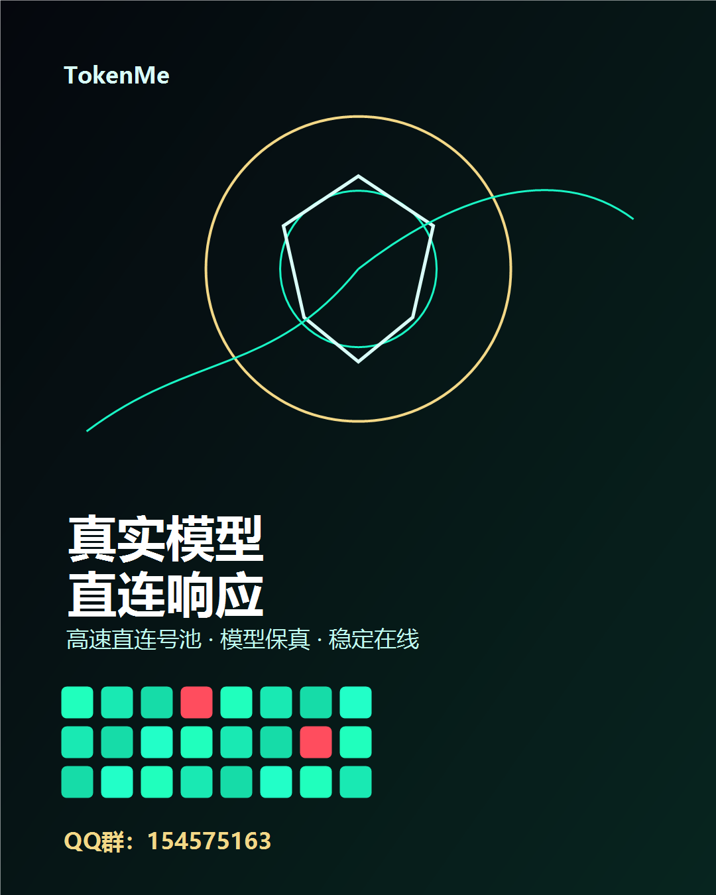

# TokenMe

TokenMe 是一款面向 Codex、GPT、Claude 等 AI 工具用户的高速直连号池客户端，主打模型保真、低延迟响应、稳定在线和无限续杯体验。

## 核心关键词

Codex 工具、GPT 工具、Claude 工具、无限续杯工具、高速直连号池、真实模型、模型保真、低延迟响应、稳定在线、桌面客户端、AI 生产力工具。

## 下载

请到右侧 Releases 下载最新版 Windows 压缩包：

- TokenMe Windows x64
- 解压后运行安装程序
- 登录账号后点击“开始起飞”

最新版下载地址：

https://github.com/Neuxsbot/tokenme-download/releases/latest

## 适合谁用

- 想让 Codex 更稳定、更顺手的用户
- 经常使用 GPT、Claude 进行代码、写作、分析、自动化工作的用户
- 需要高速响应、真实模型输出、长期稳定使用体验的用户
- 想要一套简单登录、自动配置、开箱即用的无限续杯工具的用户

## 产品特点

### 高速直连号池

TokenMe 通过高速直连号池提供稳定可用的连接体验。软件内可查看号池状态，绿色代表在线可用，少量红色代表正常波动。

### 模型保真

重点保证真实模型调用体验，适合 Codex、GPT、Claude 等高强度 AI 工作流，减少模型漂移和体验不一致。

### 无限续杯工具

面向长期使用 AI 的用户，适合日常写代码、自动化处理、文案创作、数据分析、客服辅助等场景。

### 简洁桌面端

账号、余额、订阅组、号池状态集中显示。登录后自动同步配置，点击“开始起飞”即可使用。

## 使用步骤

1. 下载 Release 里的 Windows 压缩包
2. 解压文件
3. 运行安装程序
4. 打开 TokenMe 并登录账号
5. 查看余额、订阅组、号池状态
6. 点击“开始起飞”

## 宣传图

## 联系

QQ群：154575163